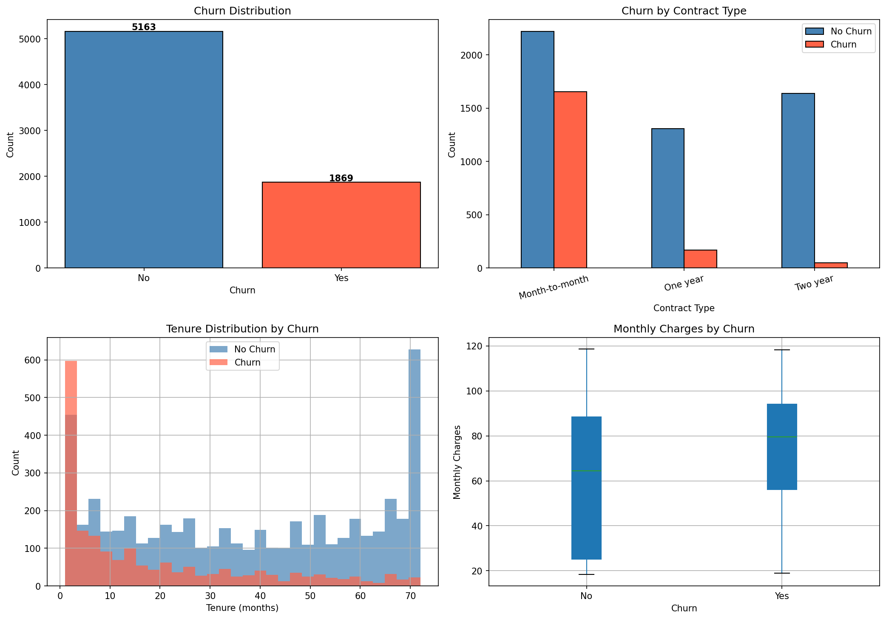
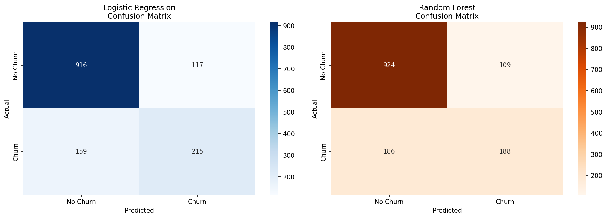
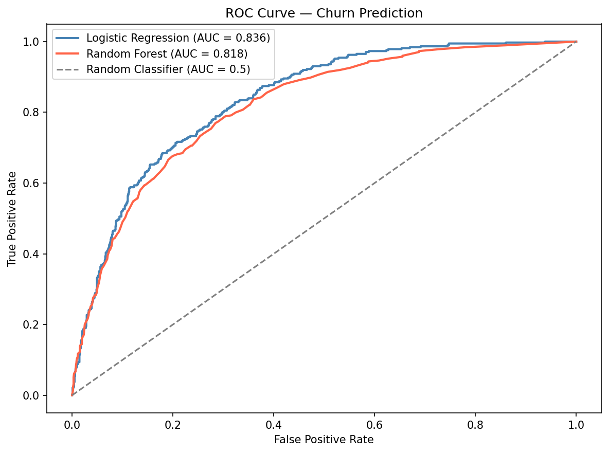
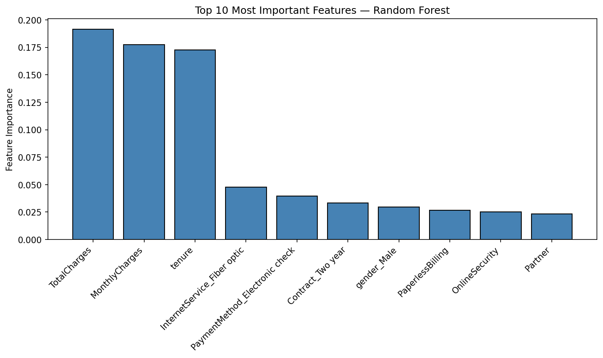

# Customer Churn Prediction

An end-to-end machine learning project that predicts whether a telecom customer is likely to churn, built with **Python**, **scikit-learn**, **XGBoost**, and **Streamlit**.

## Live Demo

[Live App](https://your-streamlit-url.streamlit.app)

## Problem Statement

Customer churn — when a customer stops using a service — is one of the most expensive problems for subscription businesses. Acquiring a new customer costs 5 to 25 times more than retaining an existing one. This project builds a machine learning model to identify high-risk customers before they leave, enabling targeted retention strategies.

## Key Findings

- **Contract type is the strongest churn driver** — month-to-month customers churn at a significantly higher rate than annual or two-year contract customers
- **New customers are highest risk** — customers with low tenure are far more likely to churn than long-term customers
- **Higher monthly charges correlate with churn** — customers paying more have stronger motivation to switch to cheaper competitors
- **Logistic Regression outperforms ensemble methods** — suggesting churn relationships in this dataset are largely linear

## Model Results

| Model | Accuracy | F1 Score | AUC-ROC |
|---|---|---|---|
| **Logistic Regression** | **80.4%** | **0.609** | **0.836** |
| Random Forest | 79.0% | 0.560 | 0.818 |
| XGBoost | 77.8% | 0.568 | 0.820 |

Logistic Regression was selected for deployment due to its superior performance and interpretability.

## Features

- Exploratory data analysis with churn distribution, contract type analysis, tenure patterns, and monthly charges breakdown
- Feature engineering — binary encoding, one-hot encoding, handling of multi-value categorical columns
- Three model comparison — Logistic Regression, Random Forest, XGBoost
- Evaluation with accuracy, F1 score, AUC-ROC, confusion matrix, and ROC curve
- Feature importance analysis showing top churn predictors
- Interactive Streamlit app for real-time churn probability prediction
- Risk factor explanation — highlights which customer attributes are contributing to churn risk

## Tech Stack

- **Data Analysis:** Pandas, NumPy
- **Visualization:** Matplotlib, Seaborn, Plotly
- **Machine Learning:** scikit-learn, XGBoost
- **Model Persistence:** joblib
- **App:** Streamlit
- **Dataset:** IBM Telco Customer Churn (Kaggle)

## Project Structure

```bash
.
├── data/
│   └── WA_Fn-UseC_-Telco-Customer-Churn.csv
├── model/
│   ├── churn_model.pkl
│   ├── scaler.pkl
│   └── feature_names.pkl
├── notebook.ipynb
├── app.py
├── requirements.txt
└── README.md
```

## Installation

### 1. Clone the repository

```bash
git clone https://github.com/Vansh-Talwar/CustomerChurnPrediction.git
cd CustomerChurnPrediction
```

### 2. Create a virtual environment

```bash
python -m venv venv
source venv/bin/activate
```

### 3. Install dependencies

```bash
pip install -r requirements.txt
```

### 4. Add the dataset

Download the dataset from [Kaggle](https://www.kaggle.com/datasets/blastchar/telco-customer-churn) and place it in the `data/` folder.

## Run the Notebook

```bash
jupyter notebook notebook.ipynb
```

## Run the App

```bash
streamlit run app.py
```

## How It Works

### Data Pipeline
1. Load IBM Telco Customer Churn dataset — 7032 clean records after removing 11 invalid rows
2. Fix `TotalCharges` column incorrectly stored as string
3. Binary encode yes/no columns
4. Simplify multi-value service columns — treat `No internet service` as `No`
5. One-hot encode categorical columns — gender, internet service, contract, payment method
6. Stratified 80/20 train/test split to preserve churn ratio
7. StandardScaler applied on training data only to prevent data leakage

### Why Logistic Regression Won
The dataset has mostly linear relationships between features and churn. Simpler models often outperform complex ensemble methods when the underlying patterns are linear. This also makes the model more interpretable — important for business stakeholders who need to understand and act on predictions.

### Why AUC-ROC Matters More Than Accuracy
The dataset is imbalanced — 73% no churn, 27% churn. A model that always predicts no churn would get 73% accuracy without learning anything. AUC-ROC of 0.836 means the model correctly ranks a churner above a non-churner 83.6% of the time — a much more meaningful metric for imbalanced classification.

## EDA Charts



## Model Evaluation





## Feature Importance



## Future Improvements

- Handle class imbalance with SMOTE oversampling
- Tune decision threshold for higher recall on churners
- Add SHAP values for individual prediction explanation
- Experiment with neural network classifier
- Build a batch prediction pipeline for scoring entire customer lists

## Resume-Ready Project Summary

Performed exploratory data analysis on 7000+ IBM Telco customer records, engineered features across 20+ variables, and benchmarked Logistic Regression, Random Forest, and XGBoost — with Logistic Regression achieving the best performance at 80.4% accuracy and 0.836 AUC-ROC — deployed as an interactive Streamlit app for real-time customer churn probability scoring.

## License

This project is for educational and portfolio use.